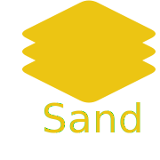
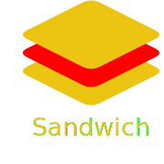

   
   
  

 

   
  
  
  
  
   
  

 

_Sand_ is the newest, dynamically typed, interpreted programming language.

 

### Table of Contents

- [History](#history)
- [Project Stats](#project-stats)

---

 

## History

_Sand_ was created as part of @Neuron-AI by @Password-Classified in 2021. Originally, it was named _Sandwich_, but the logo didn't seem right, and looked better and sounded better as _Sand_ as it is today.

 

  
  

And so _Sand_ was born! The aim of the project is to create a versatile language that can be interpreted, and compiled or translated (in the future), so that we can finally have an easy-to-use, beginner-friendly (but still performant) programming language that can be used for almost anything. Also part of that vision is to have an extensive standard library, written in its parent language, Go, that will include many complex tasks such as machine learning, CLI development, databasing, game dev, GUIs and more!

 
 

---

 

## Project Stats

| Statistic | Badge                                                                                                                                                                                                                                                                                                               |
| --------- | ------------------------------------------------------------------------------------------------------------------------------------------------------------------------------------------------------------------------------------------------------------------------------------------------------------------- |
| Activity  |                                                                                                           |
| Issues    |                                                       |
| Size      |                                                                 |
| Releases  |    |
| License   |                                                                                                                                                                                                                                        |
